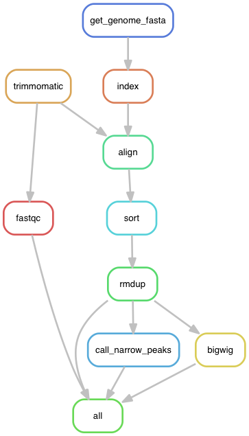

# ChIP_seq_Snakemake
A snakemake pipeline for the analysis of paired-end Illumina ChIP-seq data.

# Aim

Snakemake pipeline made for reproducible analysis of paired-end Illumina ChIP-seq data. The desired output of this pipeline are:

- Quality controls files to check for the quality of the reads. Reads are processed by programs such as fastqc and deeptools in order to produce graph that are easily readable and inform quickly about the quality of the experiment.

- Portable visualization files `bigwig files`, these files have a `.bw` extension and are relatively small (compared to sam and bam files). There are used to visualize the read coverage over a genome and can be simply be drag and drop in a genome viewer such as [IGV](http://software.broadinstitute.org/software/igv/), [JBrowse](https://jbrowse.org) or [UCSC](https://genome.ucsc.edu).

- Peaks informations files, these `bed` files gather the information about the peak calling produces by the MACS2 algorithm. The `.narrowPeak` and `.broadPeak` files can be used to visualize the peak location as the `bigwig` files but also used downstream analysis such as the intersection of peaks between replicates and different treatments.

- Deeptools visualization of the reads over genomic features such as the genes transcriptions start sites or other features.

Informations about the output of the pipeline can be found in the part **Main outputs** of this documentation.

# Content of the repository

- **Snakefile** containing the "recipes" of rules to generate the desired outputs from the input files.

- **config/** , folder containing the configuration files making the Snakefile adaptable to any input files, genome and parameter for the rules. Adapt the config file and its reference in the Snakefile. Please also pay attention to the parameters selected for deeptools, for convenience and faster test the **bins** have been defined at `1000bp`, do not forget to adapt it to your analysis.

- **Fastq/**, folder containing subsetted paired-end fastq files used to test locally the pipeline. Generated using [Seqtk](https://github.com/lh3/seqtk): `seqtk sample -s100 read1.fq 5000 > sub1.fqseqtk sample -s100 read2.fq 5000 > sub2.fq`. RAW fastq or fastq.gz files should be placed here before running the pipeline.

- **envs/**, folder containing the environment needed for the Snakefile to run. To use Snakemake, it is required to create and activate an environment containing snakemake (here : envs/global_env.yaml ). The **Snakefile** will load the required environment for each rules automatically, no modification is required here only if a rule is added.

- **units.tsv**, is a *tab separated value files* containing information about the experiment name, the condition of the experiment (control or treatment) and the path to the fastq files relative to the **Snakefile**. **Change this file according to your samples.**

- **rules/**, folder containing the rules called by the snakefile to run the pipeline, this improves the clarity of the Snakefile and might help modifying the file in the future.

# Usage

## Conda environment

First, you need to create an environment for the use of Snakemake with [Conda package manager](https://conda.io/docs/using/envs.html).
1. Create a virtual environment named "chipseq" from the `global_env.yaml` file with the following command: `conda env create --name chipseq --file ~/envs/global_env.yaml`
2. Then, activate this virtual environment with `source activate chipseq`

The Snakefile will then take care of installing and loading the packages and softwares required by each step of the pipeline.

# Test run on small fastq test files
To test this pipeline, you will need Snakemake installed on your local machine. If you have activated the 'chipseq' environment (see above), then Snakemake 5.2.0 is already installed and in use.    
If the `singularity` software is available on your machine and you want to use 10 CPUs (`--cores 10`), then run `snakemake --use-conda --use-singularity --cores 10`

## Configuration file

The `config.yaml` file specifies custom options for Snakemake:

- Sample information `units: units.tsv` indicates where to find the sample names. Paired-end files should be provided such as the forward read is to be found in the `fq1` column while the reverse read in the `fq2` column. Please pay attention at respecting the spaces between the filenames, these should be **tab sepatation** or **4 spaces**.

- The directories:
  - `working_dir`: a temporary directory that can be removed after the run
  - `result_dir`: a directory that contains the desired output files at the end of the run

- The link to the reference genomes used for the mapping, please note that if you have a favorite version of the genome that you use in a genome browser you should use the same or update your reference genome in the genome browser in order to avoid compatibility problems.

- Parameters for various tools in the pipeline, every tools in the pipeline offer a range of possible change in their parameters. It would be too long to describe them here but you can find these parameters in the manual of the tools.

This configuration file is then used to build parameters in the main `Snakefile`.

## Snakemake execution

The Snakemake pipeline/workflow management system reads a master file (often called `Snakefile`) to list the steps to be executed and defining their order.
It has many rich features. Read more [here](https://snakemake.readthedocs.io/en/stable/).

## Test run

Use the command `snakemake -np` after activating the `chipseq environment` to perform a dry run that prints out the rules and commands. If there is no **RED** message, everything is fine and you can proceed to the **Real run**

## Real run

**Within** the folder containing the **Snakefile** (if unchanged `Snakemake_ChIPseq_PE/`, simply type `Snakemake --use-conda --use-singularity` and provide the number of cores with `--cores 10` for ten cores for instance.

For cluster execution, please refer to the [Snakemake reference](https://snakemake.readthedocs.io/en/stable/executable.html#cluster-execution).

Please pay attention to `--use-conda`, it is required for the installation and loading of the dependencies used by the rules of the pipeline.

# Main outputs

The main output are :

- **fastqc** : Provide informations about the quality of the sequences provided and generate a html file to visualize it. More information to be found [here](https://www.bioinformatics.babraham.ac.uk/projects/fastqc/)

- **bed** : Provide information generated by the MACS2 algorithm for the locations and significance of peaks. These files can be used for direct visualization of the peaks location using IGV or as an input for further analysis using the [bedtools](https://bedtools.readthedocs.io/en/latest/content/bedtools-suite.html)

- **bigwig files** : Provides files allowing fast displays of read coverages track on any type of genome browsers.

- **plotFingerprint** contains interesting figures that answer the question: **"Did my ChIP work???"** . Explanation of the plot and the options available can be found [here](https://deeptools.readthedocs.io/en/develop/content/tools/plotFingerprint.html)

- **PLOTCORRELATION** folder contain pdf files displaying the correlation between the samples tested in the ChIP experiment, many options in the plotcorrelation rules can be changed via the configuration file. More information about this plot can be found [here](https://deeptools.readthedocs.io/en/develop/content/tools/plotCorrelation.html)

- **HEATMAP** folder contain pdf files displaying the content of the matrix produced by the `computeMatrix` rule under the form of a heatmap. Many option for the `computeMatrix` and the `plotHeatmap` rules can be changed in the configuration file. More information about this figure can be found [here](https://deeptools.readthedocs.io/en/develop/content/tools/plotHeatmap.html).

- **plotProfile** folder contain pdf files displaying profile plot for scores over sets of genomic region, again the genomic region are define in the matrix made previously. Again there are many options to change the plot and more information can be found [here](https://deeptools.readthedocs.io/en/develop/content/tools/plotProfile.html)

Optionals outputs of the pipelines are **bamCompare**, **bedgraph** and **bed files for broad peaks calling**.

# Directed Acyclic Graph of the Snakemake ChIP-seq PE pipeline

This graph has been produced with the command: `snakemake --rulegraph |dot -Tpng > dag.png`

